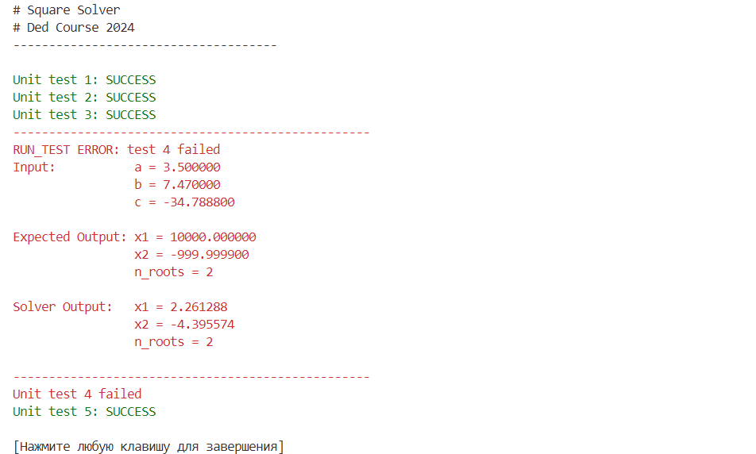

# SQUARE SOLVER

Project for solving square equations using different features

## Installation
```shell
git clone https://github.com/coffee8cat/SquareSolver
```

## Using

For separated compilation and faster setup of [TXLib](https://github.com/ded32/TXLib):
```shell
make TXLib/TXLib.o
```
After doing that once, compile as shown below:
```shell
make create_obj
make linking
```

To run programm with default mode(input from command line) use
```shell
make run
```
or
```shell
build/sqsolver.exe
```

**For more features use flags:**
    * **-h** or **--help**: prints info about flags
    * **-u** or **--unit_testing**: starts unit testing of square solver
    * **-f** or **--file_input**: reads coefficients for many square equations and solves them

Each flag will be executed only once with priority: -h > -u > -f, the flags order doesn't matter

**Example of unit testing results:**



## Creating documentation with doxygen
for creating documentation use command line:
```shell
doxygen doxygen_config
```
About doxygen:
[DOXYGEN DOCUMENTATION](https://nnstreamer.github.io/doxygen-documentation.html)
